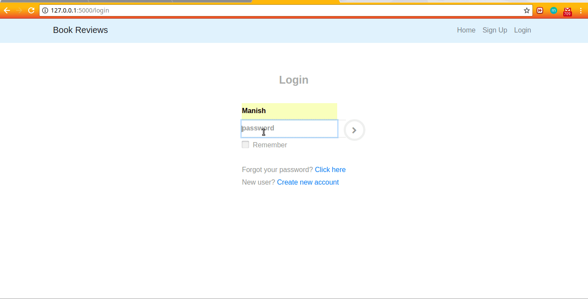

Project : Book Reviews

In this project, users is be able to register for the website and then log in using their username and password. Once they log in, they are be able to search for books, leave reviews for individual books, and see the reviews made by other people. 
It also use the a third-party API by Goodreads i.e another book review website, to pull in ratings from a broader audience. Finally, users is be able to query for book details and book reviews programmatically via the website’s API.

For using api, http://127.0.0.1:5000/api/books/book_id

Built Using:
    - PostgreSQL (https://www.heroku.com/)
    - Python and Flask
    - Goodreads API
    - Google books API